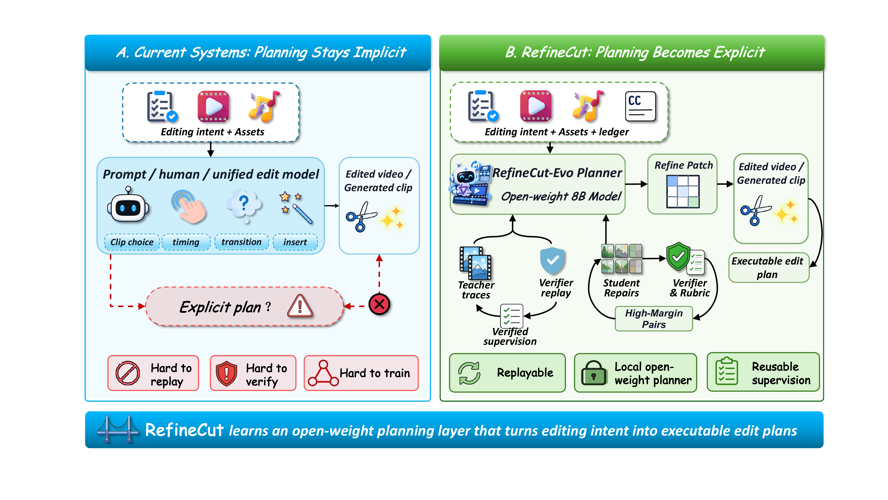
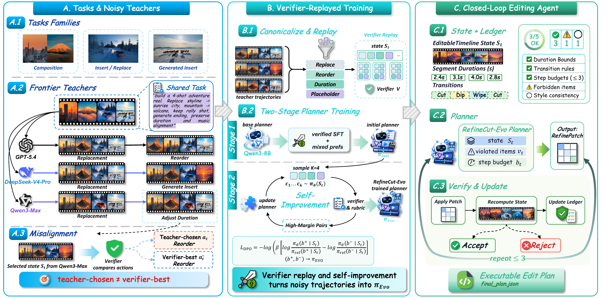
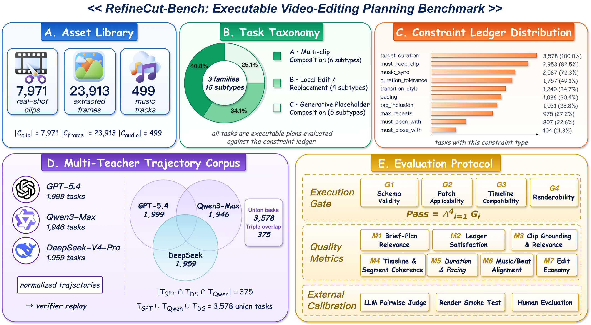
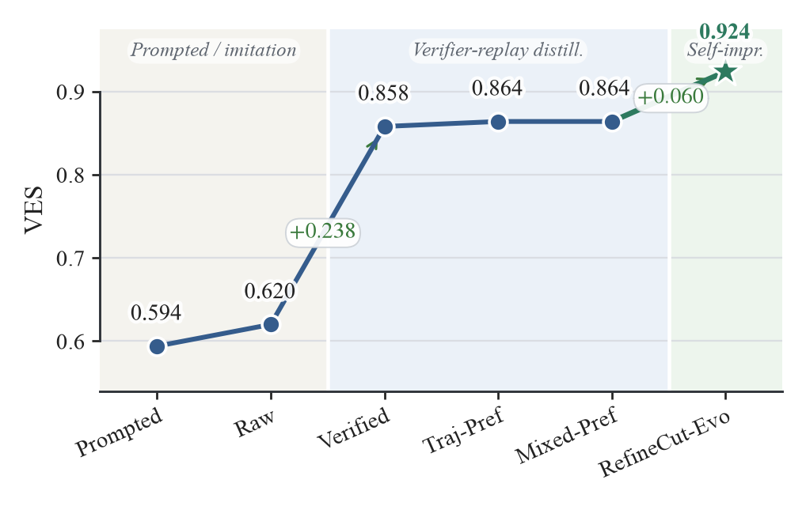
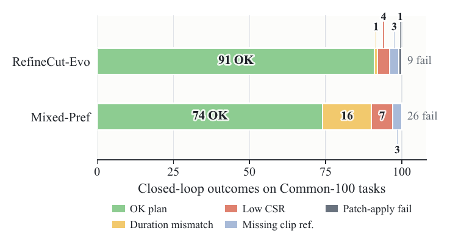

<div align="center">

# RefineCut

**Plans You Can Check: Verifier-Grounded Learning of an Open-Weight Planner for Executable Video-Editing**

EMNLP 2026 (Main Conference)

[](#citation)
[](https://arxiv.org/abs/2608.25622)
[](https://huggingface.co/datasets/Randallhy/RefineCut-Bench)
[](LICENSE)



</div>

RefineCut treats video editing as *executable video-editing planning*: a planner edits a typed timeline
through structured `RefinePatch` operations, and a deterministic verifier applies each patch and re-checks an
explicit constraint ledger. The planner is trained in two stages — verifier-replayed distillation of
multi-teacher trajectories, then verifier-centered self-improvement (**RefineCut-Evo**) — and runs in a closed
verifier loop with no teacher calls at inference.

**Status**: code release in preparation for the camera-ready.

## Framework

<p align="center"></p>

## RefineCut-Bench

3,578 tasks with briefs and explicit constraint ledgers, schema-constrained captions and metadata for 7,971
real clips and 499 music tracks, all splits, and the canonicalized multi-teacher trajectories with per-branch
verifier replay scores — to be released at
[Randallhy/RefineCut-Bench](https://huggingface.co/datasets/Randallhy/RefineCut-Bench).

<p align="center"></p>

## Results

Verifier-replayed distillation lifts an 8B planner from 0.620 to 0.858 VES on RefineCut-Bench, and
RefineCut-Evo reaches 0.924 — beside its frontier teachers in the identical closed loop, with the
verified-over-raw gain carrying over to Llama-3.1-8B and GLM-4-9B.

<p align="center">

&nbsp;

</p>

## Repository layout

```
refinecut/        typed timeline state, constraint ledger, RefinePatch apply, caption schema
refinecut_eval/   deterministic verifier, RefinePatch canonicalization,
                  closed-loop evaluation harness, VES metric aggregation
prompts/          the PatchPlanner evaluation prompt
schemas/          JSON schemas: constraint ledger, edit plan, RefinePatch,
                  timeline IR, verifier output
docs/             metric definitions, VES formula, verifier implementation notes
examples/         a worked task with its verifier replay
```

## Citation

Paper: [arXiv:2608.25622](https://arxiv.org/abs/2608.25622) — accepted to EMNLP 2026 (Main Conference); the official proceedings entry will be linked here once available.

```bibtex
@inproceedings{refinecut2026,
  title     = {Plans You Can Check: Verifier-Grounded Learning of an Open-Weight Planner for Executable Video-Editing},
  author    = {Wang, Haoyu and Feng, Cheng and Bian, Liuyang and Huang, Ruiyang and Wei, Lei and Wen, Yafei and Chen, Xiaoxin and Tang, Xiaoying},
  booktitle = {Proceedings of the 2026 Conference on Empirical Methods in Natural Language Processing},
  year      = {2026},
  note      = {to appear}
}
```

## License

Code: Apache-2.0. RefineCut-Bench will be released separately under CC BY-NC 4.0; raw video clips and music are
referenced by their public source identifiers and are not redistributed.
